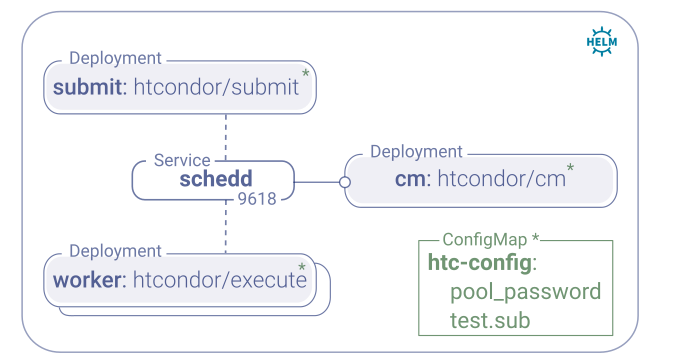

# Mini HTCondor Deployment

Here we have Kubernetes and Docker Swarm approaches for deploying a self-contained HTCondor infrastructure (central manager, workers and a submit node) using the container images provided by [mini HTCondor](https://github.com/htcondor/htcondor/tree/master/build/docker/services). This may be useful for learning purposes as well as testing services against HTCondor.

## Kubernetes

The _mini-htcondor_ chart provides a minimal default setup of HTCondor central manager and workers. Resources deployed by the chart are shown in the diagram below.



### Usage

1. Deploy the chart within the _default_ namespace and check readiness of the containers: _READY_ (1/1)

```console
~$ helm upgrade --install htcondor mini-htcondor

~$ kubectl get pods
```

2. Ensure that the central manager has detected the worker nodes. If command returns nothing, take a moment and try again.

```console
~$ kubectl get pods | grep cm

htcondor-cm-557b5f966d-pnpwh       1/1     Running   0          115s

~$ kubectl exec htcondor-cm-557b5f966d-pnpwh condor_status

Name                                   OpSys      Arch   State     Activity     LoadAv Mem   ActvtyTime

slot1@htcondor-worker-85df875d5c-c8l88 LINUX      X86_64 Unclaimed Benchmarking  0.000 1024  0+00:00:03
slot1@htcondor-worker-85df875d5c-stfmt LINUX      X86_64 Unclaimed Idle          0.000 1024  0+00:00:03

               Machines Owner Claimed Unclaimed Matched Preempting  Drain

  X86_64/LINUX        2     0       0         2       0          0      0

         Total        2     0       0         2       0          0      0
```

3. Submit test job from local submit node and wait for the job to finish to see on which worker it landed.

```console
~$ kubectl get pods | grep submit

htcondor-submit-fb68467d5-w2pjm    1/1     Running   0          12m

~$ kubectl exec ti htcondor-submit-fb68467d5-w2pjm bash

[submituser@htcondor-submit-fb68467d5-w2pjm ~]$ su submituser && cd /home/submituser

[submituser@htcondor-submit-fb68467d5-w2pjm ~]$ condor_submit test.sub 
Submitting job(s).
1 job(s) submitted to cluster 1.

[submituser@htcondor-submit-fb68467d5-w2pjm ~]$ condor_q

-- Schedd: htcondor-submit-fb68467d5-w2pjm : <10.100.215.217:9618?... @ 08/14/20 11:39:29
OWNER      BATCH_NAME    SUBMITTED   DONE   RUN    IDLE  TOTAL JOB_IDS
submituser ID: 1        8/14 11:38      _      1      _      1 1.0

[submituser@htcondor-submit-fb68467d5-w2pjm ~]$ cat test.1.0.out 
htcondor-worker-85df875d5c-stfmt
```

## Docker Swarm

For local tests using Docker Swarm you can spin up the HTCondor instance with 2 (default) workers. The following example was tested with docker version `19.03.12`.

### Usage

1. Start the HTCondor service stack using the provided Docker compose file. Ensure that the _DESIRED STATE_ is _RUNNING_ for all containers.

```console
~$ docker stack deploy -c docker-compose.yml htcondor

~$ docker stack ps htcondor
```

2. Make sure the Central Manager has detected all the workers. If you are too quick and do not see the workers: relax, take a break, make some tea and try again in a minute.

```console
~$ docker ps | grep cm

58aa8c800a09        htcondor/cm:8.9.6-el7        "/bin/bash -x /start…"   5 minutes ago  ...

~$ docker exec 58aa8c800a09 condor_status
Name               OpSys      Arch   State     Activity LoadAv Mem   ActvtyTime

slot1@6d38de236cc4 LINUX      X86_64 Unclaimed Idle      0.000 1024  0+00:00:03
slot1@ec578e473d2b LINUX      X86_64 Unclaimed Idle      0.000 1024  0+00:00:03

               Machines Owner Claimed Unclaimed Matched Preempting  Drain

  X86_64/LINUX        2     0       0         2       0          0      0

         Total        2     0       0         2       0          0      0
```

3. Submit a test job from the submit container and wait for the job to complete. The output will show you which worker you ran on.

```console
~$ docker ps | grep submit

1574cc8b8ac        htcondor/submit:8.9.6-el7    "/bin/bash -x /start…"   10 minutes ago  ...

~$ docker exec -ti -u submituser 1674cc8b8ac bash

[submituser@1574cc8b8acd ~]$ cd /home/submituser
[submituser@1574cc8b8acd ~]$ condor_submit test.sub

[submituser@1574cc8b8acd ~]$ condor_q

-- Schedd: 1574cc8b8acd : <10.0.2.9:9618?... @ 08/14/20 08:52:08
OWNER      BATCH_NAME    SUBMITTED   DONE   RUN    IDLE  TOTAL JOB_IDS
submituser ID: 1        8/14 08:52      _      _      1      1 1.0

Total for query: 1 jobs; 0 completed, 0 removed, 1 idle, 0 running, 0 held, 0 suspended 
Total for submituser: 1 jobs; 0 completed, 0 removed, 1 idle, 0 running, 0 held, 0 suspended 
Total for all users: 1 jobs; 0 completed, 0 removed, 1 idle, 0 running, 0 held, 0 suspended

<reflect on the vastness of the universe>

[submituser@1574cc8b8acd ~]$ cat test.1.0.out 

ec578e473d2b
```
